<p align="center">
  
</p>

<h1 align="center">KGPT</h1>

<p align="center">
  <b>AI in your keyboard. Everywhere. Anytime.</b>
</p>

<p align="center">
  <a href="https://github.com/Eluea/KGPT/releases/latest">
    
  </a>
  <a href="https://t.me/SupKGPT">
    
  </a>
  <a href="LICENSE">
    
  </a>
</p>


---

## A Complete Rebirth

This isn't just an update — it's a **total transformation**.

Every line of code has been rewritten. Every feature has been reimagined. Every pixel has been redesigned.

**KGPT** brings AI to your fingertips with a stunning new interface, powerful new features, and rock-solid architecture built from the ground up.

---

## Features

- **Deep Integration**: Works in **any app** via your favorite keyboard (Gboard, Samsung Keyboard, etc.).
- **Multi-Model Support**: Use **Gemini**, **ChatGPT**, **Claude**, **Groq**, or **Mistral**.
- **Material You Design**: A beautiful UI that adapts to your system colors (Android 12+).
- **Text Actions**: Select text and process it instantly with AI (Translate, Fix Grammar, Reply).
- **Web Search**: Search the web directly from your keyboard using the `??` trigger.
- **Privacy First**: Your API keys and data are stored locally. No intermediate servers.

---

## Usage Guide

KGPT integrates directly into your typing flow.

### 1. Basic AI Trigger
Type your prompt and end it with **`$`**.
> **Example**: `Write a poem about coffee$`  
> *KGPT will replace your text with the AI's response.*

### 2. Custom Commands
Use predefined or custom commands with **`%command%`**.
> **Example**: `Hello friend%tr%` (Translates to English/Arabic)  
> **Example**: `This text has erors%fix%` (Fixes grammar)

### 3. Web Search
Type your query and end it with **`??`**.
> **Example**: `Weather in London??`

### 4. Text Actions
Select any text in any app, click "KGPT AI" (or "Process Text") in the menu, and choose an action:
- **Summarize**
- **Reply**
- **Fix Grammar**
- **Translate**

---

## Screenshots

<p align="center">
  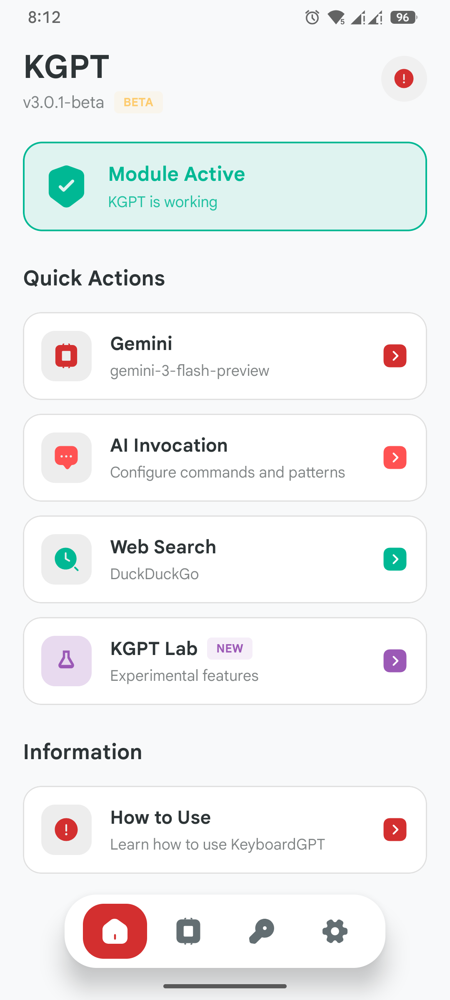
  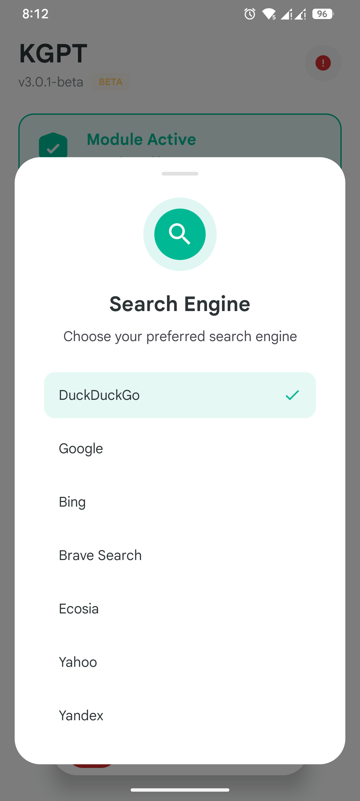
  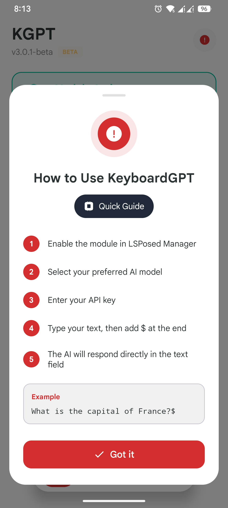
  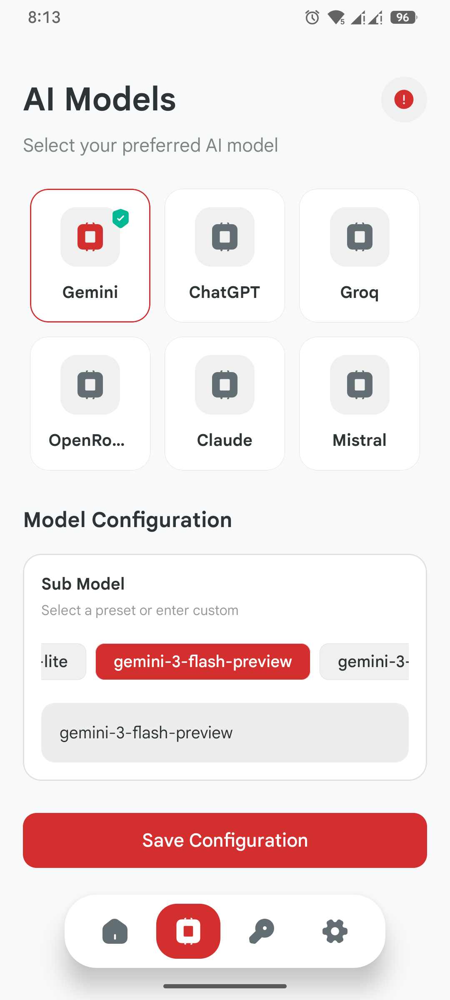
</p>

<p align="center">
  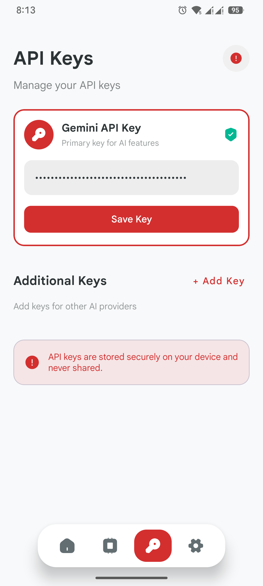
  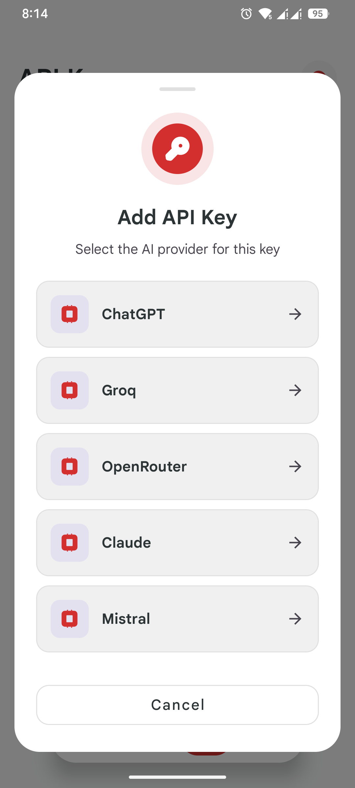
  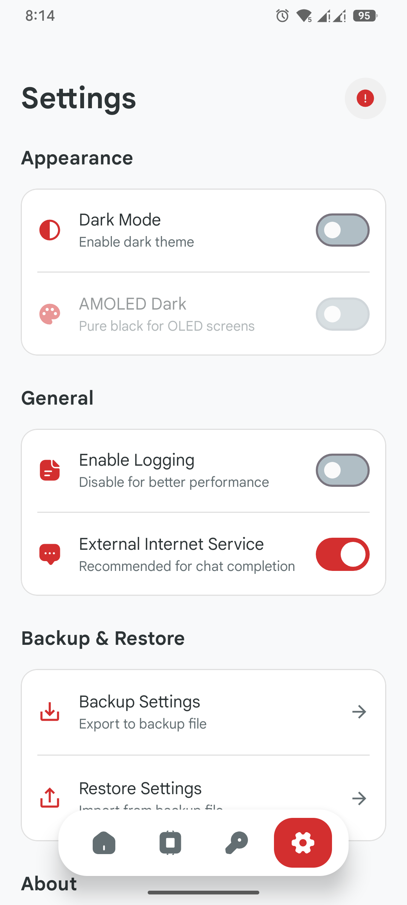
  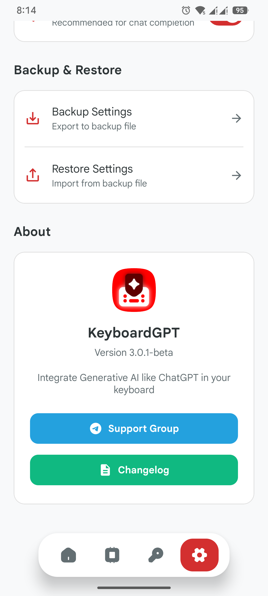
</p>

<details>
<summary><b>View More Screenshots</b></summary>
<p align="center">
  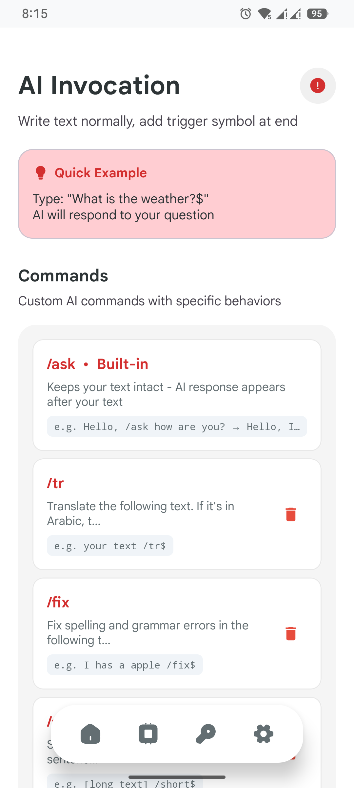
  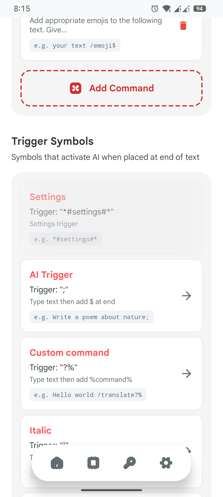
  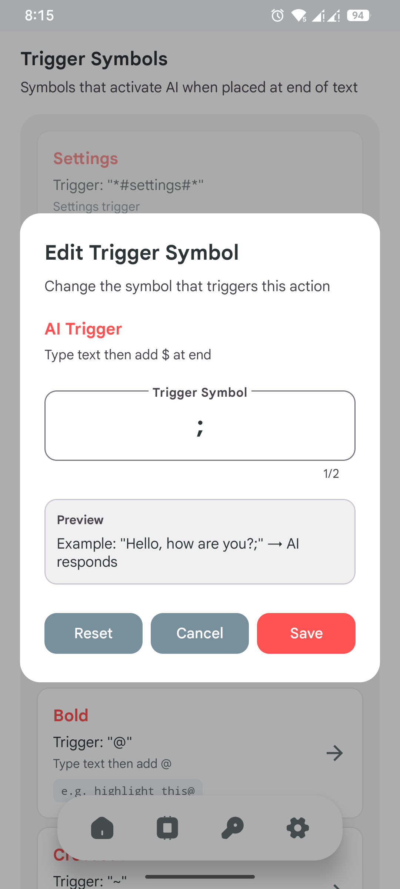
  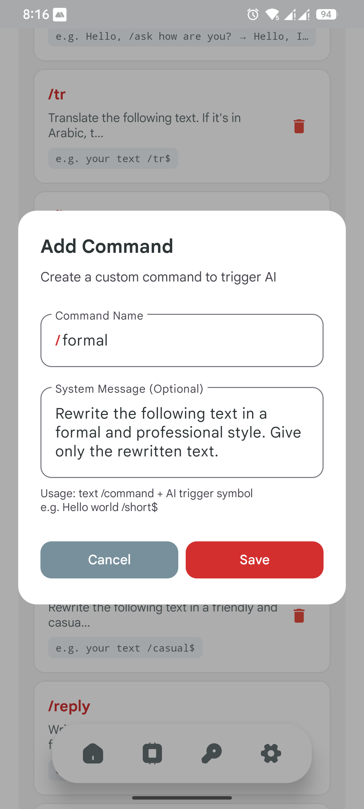
</p>
<p align="center">
  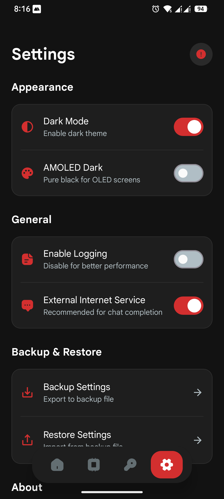
  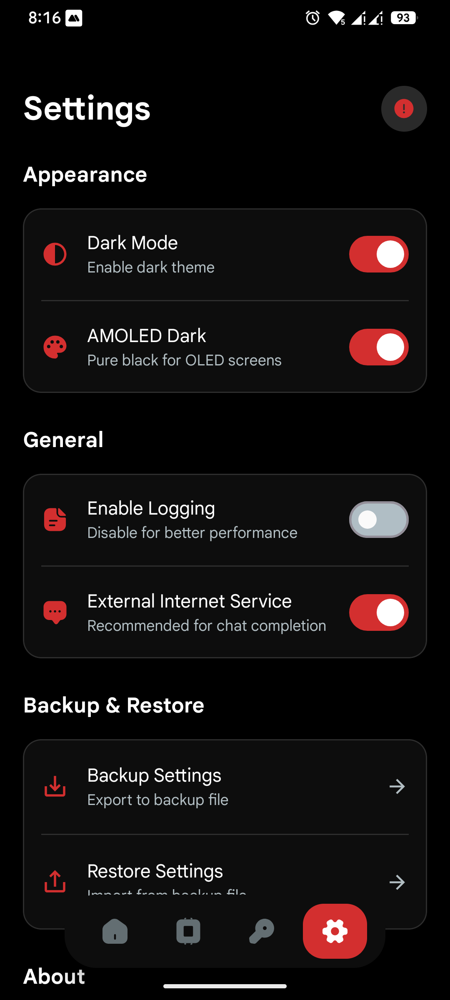
  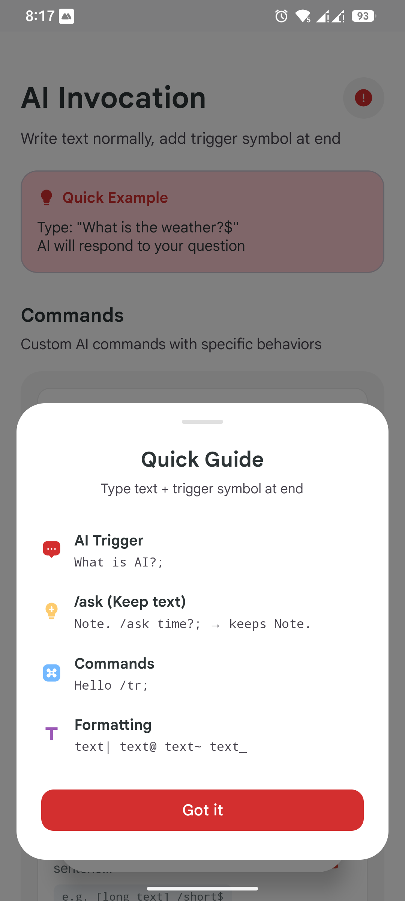
</p>
</details>

---

## Installation

### Requirements
- **Rooted Device** with **LSPosed** (Recommended)
- OR **LSPatch** (Non-Root) if you patch your keyboard app.
- Android 8.0+ (Android 12+ recommended for Material You).

### Steps
1. Download the latest APK from Releases.
2. Install the APK.
3. Open **LSPosed** notification.
4. Enable **KGPT** module.
5. Select **System Framework** (if available) and your **Target Keyboard App** (e.g., Gboard, Samsung Keyboard).
6. **Force Stop** your keyboard app to apply changes.
7. Open KGPT app to configure your API Keys.

---

## Privacy Policy

**We do not collect your data.**
- **No Analytics**: We don't track how you use the app.
- **Local Storage**: Your API keys and settings are stored encrypted on your device.
- **Direct Connection**: The app connects directly to the AI providers (Google, OpenAI, etc.). No middleman servers.

---

## Credits

This project is a fork of [KeyboardGPT](https://github.com/Mino260806/KeyboardGPT) by **Mino260806**.

Special thanks to the open-source community.

---

## License

This project is licensed under the **GNU General Public License v3.0 (GPL-3.0)**.

```
KGPT - AI in your keyboard
Copyright (C) 2023 Mino260806 (Original Author - KeyboardGPT)
Copyright (C) 2024-2025 Amr Aldeeb @Eluea (Fork Maintainer & Contributor)
```

See the [LICENSE](LICENSE) file for the full license text.

---

## Get Support

<p align="center">
  <a href="https://t.me/SupKGPT">
    
  </a>
</p>

<p align="center">
  <sub>Built with ❤️ for the Android community</sub>
</p>
